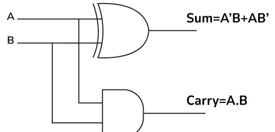
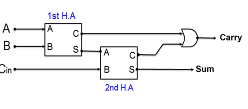
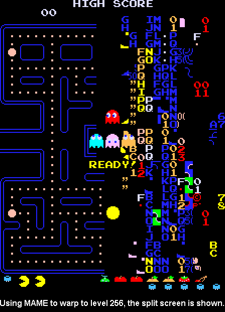
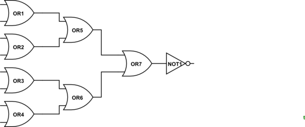
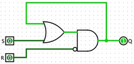

# Computer's Brain - Adders to RAM

[<- Back to blogs](/blog)

It's been a very long time since I have visited this topic.  

## **Adders :** 

They are the basic functionality of a computer to add 2 binary. There are two types of adders. `Half Adders`, `Full Adders`.  
- **Half Adders :** They are just XOR gate and AND gate combined. The AND gate is responsible for getting the Carry of Addition. Look at the examples bellow-

    | A | B | Output |
    |---|---|--------|
    | 0 | 0 | 0      |
    | 1 | 0 | 1      |
    | 0 | 1 | 1      |
    | 1 | 1 | 10     |

    
      

- **Full Adder :** On full adder we tend to take 3 inputs instead of 2, `A`, `B` and `Cin` which is carry in

    | Input |   |     | Output |       |
    |:-----:|:-:|:---:|:------:|:-----:|
    | A     | B | Cin | Sum    | Carry |
    | 0     | 0 | 0   | 0      | 0     |
    | 0     | 0 | 1   | 1      | 0     |
    | 0     | 1 | 0   | 1      | 0     |
    | 0     | 1 | 1   | 0      | 1     |
    | 1     | 0 | 0   | 1      | 0     |
    | 1     | 0 | 1   | 0      | 1     |
    | 1     | 1 | 0   | 0      | 1     |
    | 1     | 1 | 1   | 1      | 1     |

    A Full Adder combines two Half Adders: the first takes inputs A and B, and the second takes the output from the first along with the carry-in (Cin) from the previous calculation. Finally, the carries from both Half Adders pass through an OR gate to produce the new carry and sum.

      

## Flags Generated by ALU: 
The 3 important flags that an ALU generates are
- **Bit Overflow :** It is a condition when the output of the last logic full / half adder has a carryover. This is the same case what happens to pacman after `level 255` in which the ALU overflows which cause a bunch of errors and glitches.

  

- **Zero :** To check if the output of the ALU is zero the logical unit does a bunch of checks with `OR` gates to get one answer

  

  If any of the input is `1` the output is going to be `0` else the output is going to be `1`.

- **Negative :** There is a special flag given by every ALU to check if the given output is negative or not.

## Latches
- **AND OR Latch :** It remembers 1 bit of information, there are two inputs going into an AND OR Latch. `1` is to `SET` and `2` is to `Reset` it. If the set and reset is both tuned off than the output of this latch is whatever the last value was put in.

  

- **Gated Latch :** It has two inputs, `1 Data` and `2 Write Enable`. When the write enable wire is on the latch changes it's value .

## Registers
A group of latches operating at a single time (8 latches mean 1 byte of memory) is called a register.

The number of bits a register can hold is called a `width`.

## Multiplexer
A multiplexer is a combinational circuit that has many data inputs and a single output, depending on control or select inputs. 

## RAM
RAM has bunch of latches that are arranged in a grid like structure which is inturn powered by a `multiplexer`. 

There are a bunch of wires that `connect` it to the CPU.
- **Address Bus :** Address Bus is Uni directional as RAM `never` sends the cup an address. 
- **Control Bus :** It either `writes` the data to the RAM or `read` data from RAM.
- **Data Bus    :** Data bus is `bi directional`, it is the wires from where data is transferred to and from the `CPU`. If the instruction is to read the data of the address `1001`, the data is going to be sent from the data bus by the ram and vice versa.

Date: 2024-10-09

