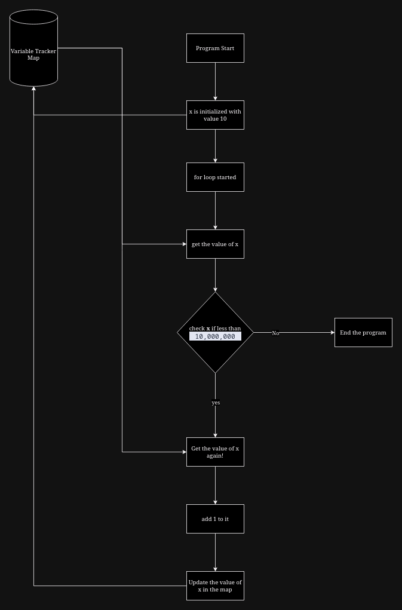

# Danfe is slow?

[<- Back to blogs](/blog)

__Building My Own Programming Language: Progress, Challenges, and Future Plans__

For the past month, I've been working on creating my own programming language, and it’s finally reaching a stage I’d call “mature.” By mature, I mean the language now supports core functionality such as creating, updating, deleting, and reading variables. It handles six data types: __string__, __int__, __float__, __table__, __function__, and variables are scoped properly.

However, there's a significant hurdle I've encountered and that is called performance issues with the interpreter. Here's the root of the problem.

---

__Understanding the Problem: The Variable Tracker Map__

My interpreter relies heavily on a map (or a dictionary) to track variables.

::: info
What is a map? 

A map is like a key-value database where each variable has a unique key, and its associated value is stored and retrieved using this key. 
:::

You might wonder what’s the issue here? Well, the problem lies in how frequently the interpreter accesses this map. Every operation in my language requires the interpreter to look up the variable in the map using its scope-specific key. For small programs, this is manageable, but for larger ones, the overhead becomes substantial.

For example, consider the following code snippet in __danfe__:


``` danfe
x = 0

for x < 10_000_000 {
    x = x + 1
}
```

This code simply increments a variable x 10 million times. But here’s the catch: executing this loop takes 2 minutes and 4 seconds. 😟 Why? Let’s break it down.

---

__The Cost of Variable Tracking: Analyzing the Bottleneck__

Here’s what happens during each iteration of the loop:

- The interpreter fetches x from the map to check the condition (x < 10_000_000).
- It fetches x again to calculate the new value (x = x + 1).
- It stores the updated value of x back into the map.

In total, the variable tracker map is accessed 5 times per iteration. Multiply that by 10 million iterations, and the map is accessed 50 million times for this single loop. That’s a massive performance hit!

---

__Visualizing the Problem__

To make it easier to understand, here’s a visual representation of what happens during each iteration:



Notice how frequently the variable tracker is called for what seems like a simple operation. This inefficiency becomes a performance bottleneck for larger programs.

---

__What’s Next? Solving the Problem__

You’re probably wondering what steps I’ve taken to address this issue. As of now, I haven’t implemented a solution yet. My current plan is to compile danfe into another, more mature programming language. By doing this, I can offload the performance-heavy tasks to a more optimized runtime environment and bypass the inefficiencies of my current interpreter.

Will this approach work? Only time will tell. how this experiment evolves!

<span style="color: gray; font-size: 14px;">Date: 2024-11-27</span>

